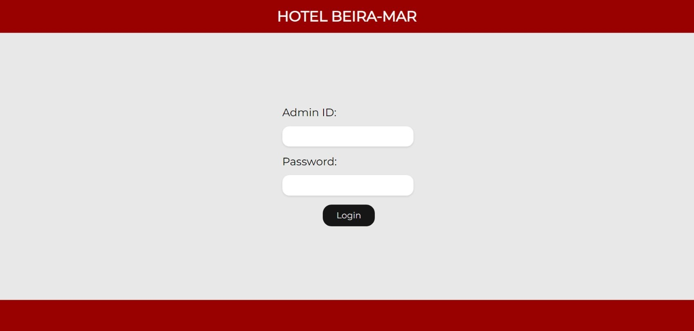

# Hotel Management Application

> The project's goal is to afford and application able to manage hotel environment.

 

## 🛠️ Features

- **Login**: login only for admins
- **Add/Remove/Update**: employes, guests, reservations
- **Filters**:
    - find by id: guests, employes, reservations, rooms
    - ascending / descending order: employes, guests, reservations
    - lowest / highest expense: guests
    - find by name / username: managers
    - find by name / last name / gender / cpf: guests, employees

 

## 💻 Requirements

Before running the application, make sure you've attended the following requirements:

- You have installed: `java 17, dependencies: spring boot, mysql`
  

## 🤝 Colaborators

<table>
  <tr>
    <td align="center">
      <a href="https://github.com/giovananog">
         
        
          <b>Giovana Nogueira</b>
        
      </a>
    </td>
    <td align="center">
      <a href="https://github.com/marcosvgalupo">
         
        
          <b>Marcos Vyctor</b>
        
      </a>
    </td>
    <td align="center">
      <a href="https://github.com/pedrohalb">
         
        
          <b>Pedro Henrique</b>
        
      </a>
    </td>
    <td align="center">
      <a href="https://github.com/Gabriel-Micael">
         
        
          <b>Gabriel Micael Henrique</b>
        
      </a>
    </td>
    <td align="center">
      <a href="https://github.com/rodrigocabraldiniz">
         
        
          <b>Rodrigo Cabral Diniz</b>
        
      </a>
    </td>
    <td align="center">
      <a href="https://github.com/otavioaugustosouzamartins">
         
        
          <b>Otavio Augusto</b>
        
      </a>
    </td>
  </tr>
</table>
